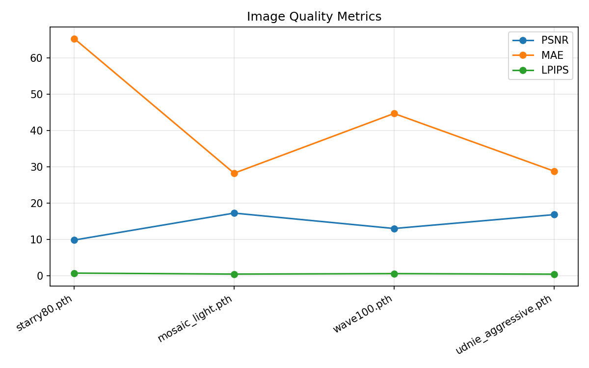

# StarryNight

StarryNight is a full-stack neural style transfer application for images and video. It combines a React frontend, a Django backend, fast PyTorch style-transfer checkpoints, and a browser-based ONNX live preview pipeline to let users stylize media with painterly effects such as Starry Night, Mosaic, Udnie, Wave, Tokyo Ghoul, Lazy Sunday, and Bayanihan.

At a product level, StarryNight is built to answer a simple question:

> What if artistic style transfer felt less like a research demo and more like a creative tool?

It supports:

- Image style transfer with a carousel of generated outputs
- Video upload and full-quality backend processing
- Live webcam preview using ONNX Runtime Web in the browser
- Persistent processed-video history for signed-in users
- JWT-based authentication, account flows, and password reset


## Why This Project Exists

Most style-transfer demos are impressive for a few seconds, but they often break down in practice:

- They are slow or GPU-dependent
- They treat images and video as separate projects
- They do not preserve user output between sessions
- They expose model internals but not a usable product flow

StarryNight tries to bridge that gap. It keeps the research roots visible, but wraps them in an interface that a student, creator, or evaluator can actually use and discuss.

## Product Overview

### Non-Technical Summary

StarryNight lets a user upload an image, upload a video, or use a webcam feed and restyle that media to look like a painting or themed artwork.

From a user’s point of view:

1. Sign in.
2. Choose image, video, or webcam mode.
3. Pick a style or preview one live.
4. Generate the stylized result.
5. Preview, browse, and download the output.

The image workflow is the fastest to demonstrate. The video workflow is the strongest for showing backend processing and persistence. The webcam workflow is the best “wow” feature because the preview happens in-browser without sending frames to the server.

### Technical Summary

StarryNight is split across three runtime layers:

- `frontend/`: React SPA with routing, auth-aware screens, webcam preview, upload forms, carousels, and playback UI
- `backend/`: Django + Django REST Framework APIs for image transfer, video jobs, model discovery, auth, and persistence
- `backend/style_transfer/`: model integration layer for fast image transfer and ReCoNet-based video stylization

The app uses:

- PyTorch for backend inference
- ONNX Runtime Web for in-browser preview
- SimpleJWT for authentication
- Django ORM for processed-video persistence
- File-backed job state for webcam/video processing status

## Key Features

### 1. Image Transfer

Users upload one image and apply all available styles at once. Results are shown in a carousel so users can compare styles without leaving the page.

Current UI behavior:

- One image upload
- Intensity slider
- Multi-style generation
- Carousel browsing
- Download button bound to the active carousel image

### 2. Video Upload

Users upload a video, choose a backend style, and submit it for server-side processing. The backend returns a processed MP4 and stores recent results for logged-in users.

### 3. Webcam Studio

The webcam view gives two experiences:

- A lightweight in-browser style preview using ONNX
- A full-quality backend processing path for captured video

This separation is deliberate. Live preview prioritizes responsiveness. Final export prioritizes quality and completeness.

### 4. Persistence

Processed videos are stored and associated with users so results can be restored after a browser refresh or later login session.

## Screens And User Flow

### Authentication

- Login
- Signup
- Forgot password
- Reset password

JWT tokens are stored in `localStorage`, and frontend requests automatically attach valid access tokens.

### Main Media Flows

- `/style_transfer`: image transfer workflow
- `/upload`: uploaded video workflow
- `/webcam`: webcam preview and recording workflow

## Repository Structure

```text
starrynight/
├── backend/
│   ├── accounts/                  # auth views, serializers, routes
│   ├── style_transfer/            # image/video transfer logic
│   ├── writer_backend/            # Django project settings
│   ├── scripts/                   # evaluation, verification, reporting
│   └── evaluation/results/        # generated benchmark reports and charts
├── frontend/
│   ├── src/screens/               # page-level React screens
│   ├── src/components/            # reusable UI components
│   └── public/models/             # ONNX assets used in-browser
├── docs/
│   └── evaluation-quality-metrics.png
└── ARCHITECTURE.md
```

## Architecture

High-level request flow:

1. The React app gathers user input.
2. Public or authenticated API requests are sent to Django.
3. Django routes requests into the `style_transfer` app.
4. PyTorch checkpoints are resolved from the backend model catalog.
5. Outputs are returned as images, video URLs, or job-status payloads.

For a one-page diagram, see [ARCHITECTURE.md](./ARCHITECTURE.md).

## Available Styles

| Style ID | Label | Checkpoint |
|----------|-------|------------|
| `starry-night` | Van Gogh – Starry Night | `models/starry/starry80.pth` |
| `mosaic` | Gaudi – Mosaic | `models/mosiac/mosaic_light.pth` |
| `udnie` | Francis Picabia – Udnie | `models/udnie_aggressive.pth` |
| `wave` | Hokusai – Great Wave | `models/wave/wave100.pth` |
| `tokyo-ghoul` | Tokyo Ghoul | `models/tokyo_ghoul/tokyo_ghoul_light.pth` |
| `lazy` | Lazy Sunday | `models/lazy/lazy250.pth` |
| `bayanihan` | Bayanihan | `models/bayanihan100.pth` |

In-browser live preview uses `frontend/public/models/pointilism-10.onnx`.

## Installation

### Requirements

- Python 3.9+
- Node.js 16 or 18
- `pip`
- `npm`

GPU is optional. CPU-only execution works, but it is slower.

### Setup

```bash
# clone / enter repo
cd starrynight

# backend dependencies
pip install -r requirements.txt

# frontend dependencies
cd frontend
npm install
```

## Running The App

### Local Development

Backend:

```bash
cd starrynight/backend
python manage.py runserver 127.0.0.1:8000
```

Frontend:

```bash
cd starrynight/frontend
npm start
```

For local development, Django uses an in-memory cache by default, so Redis is not required.

### Optional Production-Like Cache

```bash
export CACHE_BACKEND=redis
export CACHE_URL=redis://127.0.0.1:6379/1
```

## Model Verification

Before running demos or evaluations, confirm checkpoints are present:

```bash
cd starrynight/backend
python scripts/verify_models.py
```

## Evaluation

Use the evaluator at `backend/scripts/evaluate_style_transfer.py` to benchmark image and video inference.

### Image Evaluation

```bash
cd backend
python scripts/evaluate_style_transfer.py image \
  --input ../frontend/public/home/styled1.jpg \
  --style-id starry-night \
  --save-visualization evaluation/image-comparison.png \
  --json-out evaluation/image-metrics.json
```

### Video Evaluation

```bash
cd backend
python scripts/evaluate_style_transfer.py video \
  --input path/to/input_video.mp4 \
  --save-output evaluation/stylized-video.mp4 \
  --save-plot evaluation/temporal-warping-error.png \
  --json-out evaluation/video-metrics.json
```

### What “Accuracy” Means Here

This project does not use classifier accuracy. Style transfer is evaluated through quality, similarity, speed, and temporal stability metrics:

- `LPIPS`: perceptual distance between the original and stylized result
- `PSNR`: signal fidelity relative to the source image
- `MAE`: average pixel-level deviation from the source
- `TWE`: temporal warping error for video coherence
- `FPS`: processing throughput

Interpretation:

- Lower `TWE` is better for video stability
- Lower `MAE` and higher `PSNR` mean the output stays closer to the source
- `LPIPS` is nuanced in artistic transfer: a higher score can simply mean the style transformation is stronger

These numbers should be read as benchmark metrics, not as a single “accuracy” score.

### Reported Benchmark Results

Image styles measured on `frontend/public/home/styled1.jpg` at CPU, `400×300`:

| Style | Checkpoint | FPS | LPIPS | MAE | PSNR (dB) |
|-------|-----------|-----|-------|-----|-----------|
| Starry Night | `starry/starry80.pth` | 3.88 | 0.713 | 65.4 | 9.8 |
| Mosaic | `mosiac/mosaic_light.pth` | 3.59 | 0.445 | 28.3 | 17.3 |
| Udnie | `udnie_aggressive.pth` | 3.61 | 0.423 | 28.8 | 16.8 |
| Wave | `wave/wave100.pth` | 3.24 | 0.568 | 44.7 | 13.0 |
| Tokyo Ghoul | `tokyo_ghoul/tokyo_ghoul_light.pth` | 3.19 | 0.179 | 12.4 | 24.0 |
| Lazy Sunday | `lazy/lazy250.pth` | 2.93 | 0.549 | 50.0 | 11.8 |
| Bayanihan | `bayanihan100.pth` | 3.05 | 0.535 | 42.1 | 13.5 |

Video benchmark for ReCoNet at `640×360`:

| Metric | Value |
|--------|-------|
| Processing FPS (CPU) | 1.25 |
| Temporal Warping Error MAE | 0.0149 |

### Evaluation Graph

The graph below comes from `backend/scripts/evaluation_workflow.py` and summarizes image benchmark quality metrics across the evaluated styles.



### Batch Evaluation Workflow

```bash
cd starrynight/backend
python scripts/evaluation_workflow.py
```

Generated artifacts:

| File | Description |
|------|-------------|
| `results_TIMESTAMP.json` | Raw metric rows with metadata |
| `results_TIMESTAMP.csv` | Spreadsheet-friendly flat export |
| `fps_comparison_TIMESTAMP.png` | FPS comparison across checkpoints/devices |
| `quality_metrics_TIMESTAMP.png` | Line chart for PSNR / MAE / LPIPS |
| `temporal_stability_TIMESTAMP.png` | TWE comparison chart |
| `device_comparison_TIMESTAMP.png` | Device-level average FPS comparison |
| `report_TIMESTAMP.html` | HTML benchmark summary |

Open the generated report:

```bash
open backend/evaluation/results/report_*.html   # macOS
xdg-open backend/evaluation/results/report_*.html  # Linux
```

## Dataset And Model Provenance

StarryNight mixes two model lineages.

### Image-Style Lineage

The fast image-style workflow follows a `fast-neural-style` training setup:

- Content dataset: `MS-COCO 2014 train2014`
- Style supervision: one style image per checkpoint
- Backbone losses: perceptual/style/content losses through VGG

The repository’s fast-style training notes also describe:

- Roughly `40,000` training images
- `1 epoch`
- Batch size `4`

### Video-Style Lineage

The ReCoNet-related training lineage lives in the standalone research folder:

- `Real-time-Coherent-Style-Transfer-For-Videos/`

That training setup references:

- `MPI Sintel`
- `FlyingChairs`

These datasets support temporal training using flow and occlusion information.

### Pretrained Model Source

The main README credits the bundled image checkpoints as taken from:

- `https://github.com/zhanghang1989/PyTorch-Multi-Style-Transfer`

Important caveat: the benchmark numbers in this repo are sample-workflow measurements, not a formal held-out-dataset claim across a curated benchmark suite.

## API Overview

Representative endpoints:

- `POST /accounts/login/`
- `POST /accounts/register/`
- `POST /accounts/forgot-password/`
- `POST /accounts/reset-password/`
- `GET /style_transfer/models/`
- `POST /style_transfer/style/`
- `GET /style_transfer/webcam-styles/`
- `POST /style_transfer/webcam-video/`
- `GET /style_transfer/video-status/<job_id>/`
- `GET /style_transfer/my-videos/`

## Persistence And Background Processing

For video processing, the system uses:

- Django media/file outputs for processed MP4 files
- Database persistence through processed-video records
- File-backed job state for status restoration

This enables:

- Restoring recent results after refresh
- Recovering job metadata after the session ends
- Showing user-specific video history

## Frontend Notes

The frontend uses a neumorphism-inspired design system and includes:

- Auth-aware routes
- Drag-and-drop file selection
- Video polling and restore logic
- Carousel-based browsing for styled images
- A single download action that follows the active carousel slide

## Limitations

- CPU inference is significantly slower than CUDA
- Image benchmark numbers come from sample inputs, not a full benchmark dataset
- Video processing is still offline/batch-oriented for high-quality export
- The webcam preview model and backend export models are not identical pipelines
- Style-transfer metrics are useful comparisons, but they are not a universal substitute for human visual judgment

## Recommended Demo Flow

If you are presenting this project live:

1. Log in and show the image-transfer workflow first.
2. Upload one image and generate all styles.
3. Use the carousel to compare outputs and download the active result.
4. Show webcam preview for the “real-time” moment.
5. End with video upload or processed-video history to show persistence.

## Quick Start

```bash
# terminal 1
cd starrynight/backend
python manage.py runserver 127.0.0.1:8000

# terminal 2
cd starrynight/frontend
npm start

# terminal 3 (optional)
cd starrynight/backend
python scripts/verify_models.py
python scripts/evaluate_style_transfer.py image \
  --input ../frontend/public/home/styled1.jpg \
  --style-id starry-night
```

## Walkthrough Video

[](https://www.youtube.com/watch?v=EddMbohoZZc)

## Credits

- Pretrained image checkpoints were credited in this repository to `zhanghang1989/PyTorch-Multi-Style-Transfer`
- The fast-style training subtree documents a `fast-neural-style`-inspired pipeline
- The ReCoNet research subtree documents the temporal video-style training lineage
